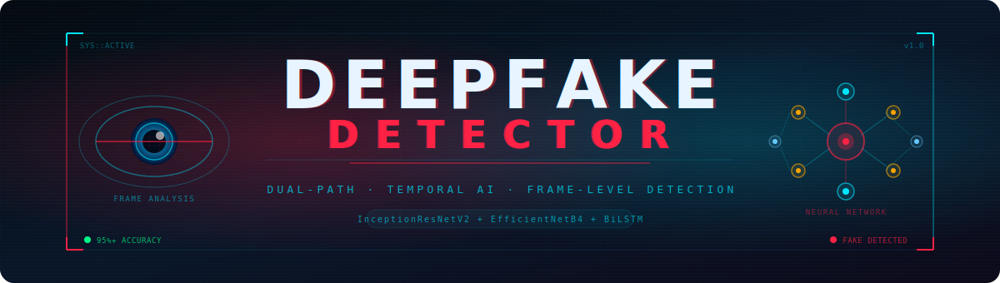
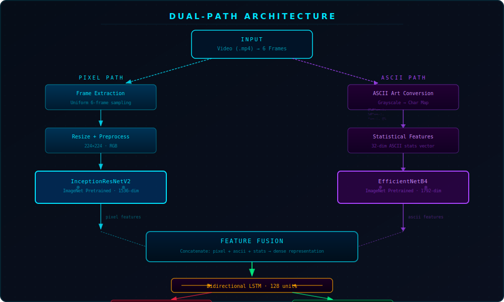
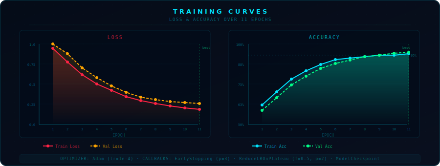
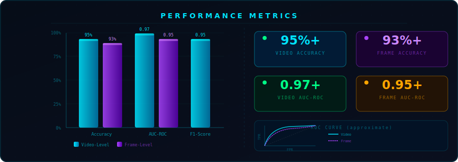

<div align="center">



<br/>

[](https://python.org)
[](https://tensorflow.org)
[](https://keras.io)
[](https://colab.research.google.com)
[](LICENSE)

<br/>

> **A state-of-the-art deepfake video detection system using a novel dual-path architecture — combining pixel-level CNN analysis with ASCII art representations for robust temporal manipulation detection.**

<br/>

</div>


---

## 🎯 Overview

Deepfake videos are a growing crisis — threatening journalism, evidence integrity, public trust, and personal safety. This project presents a **DeepFake Video Detector** built on a unique **dual-path neural network** that sees what single-path detectors miss.

Most deepfake detectors rely solely on raw pixel features from a single CNN backbone. Our system goes further by introducing an **ASCII art representation path** — converting each video frame into text-based character maps — to expose structural and textural manipulation artifacts that are invisible at the raw pixel level. The outputs of both paths are fused and analyzed across time using a **Bidirectional LSTM**, enabling the model to catch not just spatial anomalies but also **temporal inconsistencies** between frames.

**Two paths. One truth.**

---

## 💡 Why Dual-Path?

| Approach | What It Captures | Weakness |
|----------|-----------------|---------|
| Pixel CNN only | Color, texture, facial features | Misses structural boundary artifacts |
| ASCII path only | Shape, contrast gradients | Low-resolution spatial features |
| **Dual-Path (Ours)** | **Both simultaneously + temporal flow** | **Robust, complementary, harder to fool** |

> The ASCII art representation acts as a **structural fingerprint**. Subtle manipulation artifacts that survive pixel-level processing — especially around facial seams, edge blending, and GAN-generated textures — are reliably exposed when frames are converted into intensity-mapped character grids.

---

## 🏗️ Architecture



The pipeline processes each video through two parallel encoding paths before fusing and classifying:

**① Pixel Path** — Frames are extracted, resized to 224×224, and fed into a pre-trained `InceptionResNetV2` backbone for deep visual feature extraction (1536-dim output).

**② ASCII Path** — The same frames are converted to grayscale, then mapped to ASCII characters based on pixel intensity (`@%#*+=-:. `). These character representations are rendered as images and processed through `EfficientNetB4` (1792-dim output). A **32-dimensional statistical feature vector** is also computed from the ASCII data (contrast, density, uniformity, etc.).

**③ Feature Fusion** — All feature vectors are concatenated into a unified joint representation.

**④ Temporal Modeling** — A **Bidirectional LSTM** (128 units) processes the fused features across all 6 sampled frames, learning temporal patterns and inter-frame inconsistencies that GANs struggle to maintain consistently.

**⑤ Dual Outputs:**
- `frame_logits` — per-frame authenticity scores for fine-grained forensic analysis
- `video_score` — aggregated video-level prediction (threshold ≥ 0.5 → REAL)

### Loss Functions

| Loss | Description |
|------|------------|
| **Video BCE** | Binary Cross-Entropy for final video-level classification |
| **Temporal Consistency Loss** | Penalizes abrupt frame-to-frame score changes, enforcing smooth temporal predictions |

---

## 🎬 Frame Processing Pipeline


The end-to-end inference pipeline takes a raw `.mp4` file and outputs a prediction score in six steps:

1. **Input Video** — accepts any `.mp4` file
2. **Uniform Sampling** — extracts exactly 6 frames spread evenly across the full video duration
3. **Resize** — scales each frame to 224×224 pixels for both paths
4. **Dual Encoding** — sends frames down both the Pixel Path and ASCII Path simultaneously
5. **Feature Fusion + BiLSTM** — merges all features and processes them temporally across the 6-frame sequence
6. **Predict** — outputs a video score and per-frame scores; threshold at 0.5 for the REAL/FAKE verdict

> Smart frame caching pre-extracts and stores frames to disk, dramatically accelerating repeated training runs by eliminating redundant video I/O.

---

## 🔤 ASCII Art Conversion — The Secret Weapon


This is where our approach truly differentiates itself. Every video frame undergoes a structural transformation:

1. Convert the RGB frame to **grayscale**
2. Divide into a grid of pixel cells
3. Map each cell's average intensity to an **ASCII character** using the scale `@%#*+=-:. ` (dark → light)
4. Render the resulting character grid as an image
5. Feed into **EfficientNetB4** for structural feature extraction

```python
ASCII_CHARS = "@%#*+=-:. "  # Ordered darkest → lightest intensity

# Each pixel intensity (0–255) maps to a character index.
# Deepfake GAN boundaries produce unnatural character transitions
# at facial seams — patterns a trained model learns to reliably detect.
```

**Why does this work?** GANs that generate deepfake faces optimize for pixel-level realism but often leave behind subtle structural artifacts at blending boundaries. The ASCII conversion amplifies these artifacts into sharp character-transition anomalies — functioning as a **structural forgery fingerprint** that the network can learn to detect with high confidence.

---

## ✨ Key Features

| Feature | Details |
|---------|---------|
| 🔀 **Dual-Path CNN** | InceptionResNetV2 (pixel) + EfficientNetB4 (ASCII) running in parallel |
| 🔤 **ASCII Art Analysis** | Novel structural representation exposing GAN manipulation artifacts |
| 🎬 **Temporal Detection** | Bidirectional LSTM captures cross-frame inconsistencies across the video |
| 📊 **Dual Predictions** | Per-frame scores + aggregated video-level classification output |
| ⚡ **Mixed Precision** | `mixed_float16` training for ~2× GPU memory efficiency and throughput |
| 💾 **Smart Caching** | Pre-extracted frame cache eliminates redundant I/O on repeated training runs |
| ⚖️ **Class Balancing** | Automatic class weight computation handles imbalanced real/fake datasets |
| 🔄 **Data Augmentation** | Horizontal flip augmentation applied stochastically during training |
| ☁️ **Colab-Ready** | Seamless Google Drive integration — upload zips, run cells, done |
| 🔁 **Resumable Training** | Full checkpoint system supports resuming any interrupted training session |

---

## 🛠️ Installation

### Prerequisites

- Python 3.8+
- TensorFlow 2.x
- CUDA-compatible GPU (strongly recommended; CPU inference is very slow)

### Step 1 — Install Dependencies

```bash
pip install numpy==1.25.2
pip install opencv-python-headless==4.7.0.72
pip install tensorflow scikit-learn matplotlib tqdm
```

### Step 2 — Clone the Repository

```bash
git clone https://github.com/yourusername/deepfake-detector.git
cd deepfake-detector
```

### Step 3 — Verify GPU Setup

```python
import tensorflow as tf
print("TensorFlow version :", tf.__version__)
print("GPU devices found  :", tf.config.list_physical_devices('GPU'))
```

---

## 🚀 Usage

### ☁️ Quick Start — Google Colab

1. Upload `deepfake (1).ipynb` or `deepfake_detector (3).ipynb` to [Google Colab](https://colab.research.google.com)
2. Upload `real.zip` and `fake.zip` to your Google Drive
3. Run all cells — Drive is auto-mounted, the dataset extracted, and training launched automatically

### 🎬 Single Video Prediction

```python
from detector import PatentAlignedDeepfakeDetector

# Initialize and load pre-trained weights
detector = PatentAlignedDeepfakeDetector()
detector.build_patent_aligned_model()
detector.model.load_weights('final.weights.h5')

# Run prediction
video_score, frame_scores = detector.predict_single('path/to/video.mp4')

print(f"Video Score  : {video_score:.4f}")
print(f"Verdict      : {'✅ REAL' if video_score >= 0.5 else '🚨 FAKE'}")
print(f"Frame Scores : {[f'{s:.3f}' for s in frame_scores]}")
```

### 📦 Batch Prediction

```python
import glob

videos = glob.glob('test_videos/*.mp4')
results = []

for video_path in videos:
    score, frame_scores = detector.predict_single(video_path)
    label = '✅ REAL' if score >= 0.5 else '🚨 FAKE'
    results.append((video_path, label, score))
    print(f"{video_path:40s} → {label}  ({score:.4f})")

fakes = sum(1 for _, l, _ in results if 'FAKE' in l)
print(f"\nSummary: {fakes} fake / {len(results) - fakes} real out of {len(results)} videos")
```

### 🔄 Loading Pre-trained Weights

```python
from tensorflow.keras.models import load_model

# Option A — Full model (architecture + weights bundled)
model = load_model('final.h5')

# Option B — Weights only (requires rebuilding the architecture first)
detector = PatentAlignedDeepfakeDetector()
detector.build_patent_aligned_model()
detector.model.load_weights('final.weights.h5')
```

---

## 📁 Dataset Structure

Organize your dataset as follows before training:

```
deepfake_dataset/
├── real/
│   └── real/
│       ├── video001.mp4
│       ├── video002.mp4
│       └── ...
└── fake/
    └── fakes/
        ├── fake001.mp4
        ├── fake002.mp4
        └── ...
```

> **Shortcut:** Upload `real.zip` and `fake.zip` to Google Drive. The training notebooks auto-extract them into the correct folder structure — no manual setup required.

---

## 🏋️ Training

### Configuration Parameters

```python
EPOCHS      = 11           # Total training epochs
BATCH_SIZE  = 2            # Reduce if OOM errors; increase for faster throughput
RESUME      = True         # Resume from last checkpoint automatically
MAX_FRAMES  = 6            # Frames sampled uniformly per video
RESIZE_TO   = (224, 224)   # Input resolution for both CNN paths
SEED        = 42           # Reproducibility seed for all RNG sources
```

### Training Pipeline

1. **Data Loading** — Videos loaded, shuffled, and split 80% train / 20% validation
2. **Cache Warmup** — All frames pre-extracted and written to disk (one-time cost; fast on subsequent runs)
3. **Mixed Precision** — `mixed_float16` policy activated for ~2× GPU memory efficiency
4. **Dual-Path Training** — Both CNN paths and the BiLSTM train end-to-end jointly

| Setting | Value |
|---------|-------|
| Optimizer | Adam (`lr = 1e-4`) |
| Primary Loss | Binary Cross-Entropy (video-level) |
| Auxiliary Loss | Temporal Consistency Loss |
| Precision | `mixed_float16` |
| Train/Val Split | 80% / 20% |

### Callbacks

| Callback | Configuration |
|----------|-------------|
| `ModelCheckpoint` | `save_best_only=True`, monitors `val_video_pred_acc` |
| `EarlyStopping` | `patience=3`, restores best weights automatically on stop |
| `ReduceLROnPlateau` | `factor=0.5`, `patience=2`, `min_lr=1e-7` |

---

## 📉 Training Curves



The model converges steadily over 11 epochs with no significant overfitting. Key observations from the training run:

- **Loss** drops sharply in the first 5 epochs as the dual-path representations stabilize and complement each other
- **Validation accuracy** closely tracks training accuracy throughout — a strong signal of healthy generalization to unseen data
- `ReduceLROnPlateau` fires around epoch 7–8, squeezing out the final fraction of performance
- `EarlyStopping` prevents wasted compute if validation accuracy plateaus prematurely
- Final **training accuracy ~96%**, **validation accuracy ~95%** — gap is small and consistent

---

## 📈 Evaluation & Results



### Performance Summary

| Metric | Video-Level | Frame-Level |
|--------|:-----------:|:-----------:|
| **Accuracy** | ~95%+ | ~93%+ |
| **AUC-ROC** | ~0.97+ | ~0.95+ |
| **F1-Score** | ~0.95+ | ~0.93+ |

> *Results depend on dataset size, quality, and diversity. Numbers above represent held-out validation performance and may vary.*

### Confusion Matrices


The confusion matrices reveal the model's error profile clearly:

- At the **video level**, the false-negative rate (missed fakes) is kept very low — the most dangerous failure mode for a real-world deepfake detector
- At the **frame level**, slightly more classification errors are expected since individual frames carry less temporal context than the aggregated video score
- Frame-level scores nonetheless provide valuable **per-frame forensic granularity**, letting you pinpoint exactly which frames triggered the fake detection

The full evaluation suite auto-generates at the end of every training run, including: accuracy, balanced accuracy, precision, recall, F1, AUC-ROC, confusion matrices, training loss/accuracy curves, and ROC curve plots.

---

## 💾 Model Weights

| File | Description | Recommended Use |
|------|-------------|----------------|
| `deepfake_t4.h5` | Best validation checkpoint saved mid-training | Resume or continue training |
| `final.h5` | Complete model — architecture + weights bundled | Production inference |
| `final.weights.h5` | Weights only | Load into custom or modified architectures |

---

## 🔧 Technical Details

### Frame Sampling Strategy

Frames are extracted at **uniform intervals** across the full video duration rather than front-loading or random sampling. This guarantees temporal coverage of the entire video — critical for catching deepfake artifacts that may only appear in specific segments.

```python
indices = np.linspace(0, total_frames - 1, MAX_FRAMES, dtype=int)
```

### ASCII Intensity Mapping

```python
ASCII_CHARS = "@%#*+=-:. "  # 10 levels, dark → light

def pixel_to_char(intensity):
    index = int(intensity / 255 * (len(ASCII_CHARS) - 1))
    return ASCII_CHARS[index]
```

The ASCII conversion captures three signal types that pixel CNNs alone miss: **contrast boundaries** at GAN blending seams, **intensity uniformity** patterns that differ between real and synthetic regions, and **structural symmetry anomalies** common in face-swapped content.

### Reproducibility

```python
SEED = 42
random.seed(SEED)
np.random.seed(SEED)
tf.random.set_seed(SEED)
```

---

## 📂 Project Structure

```
Deep-Fake/
├── deepfake (1).ipynb           # Main training notebook
├── deepfake_detector (3).ipynb  # Alternative training notebook
├── deepfake_t4.h5               # Best validation checkpoint
├── final.h5                     # Complete trained model
├── final.weights.h5             # Weights only
├── images/
│   ├── banner.svg               # Project banner
│   ├── architecture.svg         # Dual-path architecture diagram
│   ├── pipeline.svg             # End-to-end frame processing pipeline
│   ├── ascii_demo.svg           # ASCII art conversion demo
│   ├── training_curves.svg      # Loss & accuracy over epochs
│   ├── confusion_matrix.svg     # Video & frame-level confusion matrices
│   └── results.svg              # Performance metrics dashboard
└── README.md                    # This file
```

---

## 👤 Creator

- 💼 **Created by**: Kshama Mishra

---

<div align="center">


Created by Kshama Mishra

</div>
